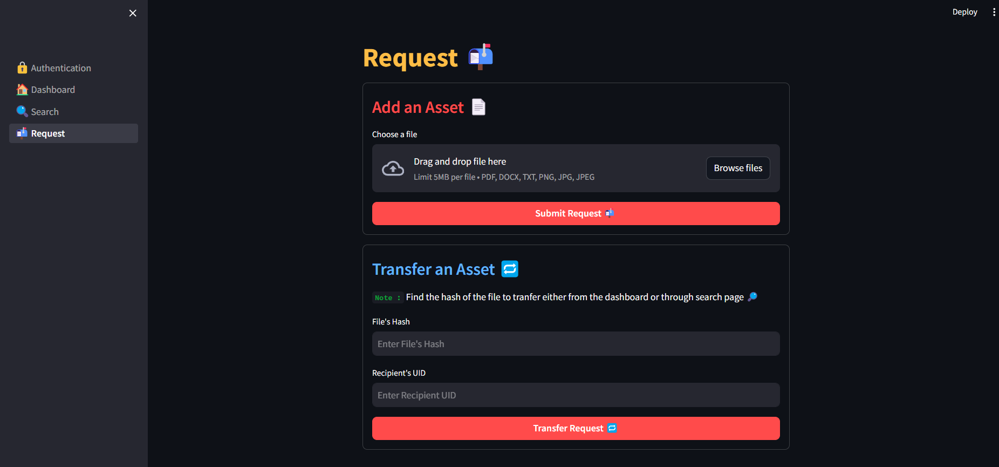

# `AssetBlock` : Assest Management System using SHA-256


## **Description 📝 :**

`AssetBlock` is a comprehensive asset management system designed to ensure the security, integrity, and efficiency of asset tracking and management. By utilizing the SHA-256 encryption algorithm, `AssetBlock` provides a robust mechanism for hashing and authentication, ensuring that all asset data remains secure and tamper-proof; And the same file can't be uploaded by different users. Once issued, the asset can be transferred betweeen the users seemlessly. 

Key features of `AssetBlock` include:

- **Secure Authentication**: Leveraging Firebase for secure user authentication, ensuring that only authorized users can access and manage assets.
- **Data Integrity**: Utilizing SHA-256 for hashing asset data, ensuring data integrity and providing a secure method for verifying data authenticity.
- **Efficient Asset Management**: A user-friendly interface for both clients and administrators to manage and track assets effectively.
- **Database Integration**: Integration with PostgreSQL for reliable and efficient data storage, providing a scalable solution for managing large volumes of asset data.

## **Setup ⚙️ :**

### ```Install Requirements 📃```
**1. Assume the ```pip``` is already installed.**  
**2. Run the following script in the terminal**

```shell
pip install -r requirements.txt
```
### ```Firebase Setup 🔥```
**1. Create a Web App in Firebase Console**  
**2. Go to Project Settings and click on ```manage service account permissions```**    


**3. Click on the three dots and select create key.**


**4. Now create a key and download the JSON File.**


**5. Now replace the contents inside ```firebase.json``` with downloaded JSON.** 

```json
{
  "type": "",
  "project_id": "",
  "private_key_id": "",
  "private_key": "",
  "client_email": "",
  "client_id": "",
  "auth_uri": "",
  "token_uri": "",
  "auth_provider_x509_cert_url": "",
  "client_x509_cert_url": "",
  "universe_domain": ""
}
```

**6. Open the ```.env``` file and replace with your postgre password and username**

```env
FIREBASE_WEB_API_KEY=YOUR_API_KEY
```
### ```PostgreSQL 📬```

**1. Download PostgreSQL from the Postgre Website**  
**2. Run the following command in the terminal to initialize the database.**  
```shell
python src/process.py
```
**Or**  
```shell
python3 src/process.py
```
**3. Open the ```.env``` file and replace with your postgre password and username**

```env
POSTGRE_PASSWORD=YOUR_PASSWORD
POSTGRE_USER=YOUR_USERNAME
```

### ```Running the script```

**Open a terminal and run the following script from the project directory.**

```shell
cd src
uvicorn api:app --reload
```

**Open another terminal and run the following srcipt from the project directory.** 


**Client 👨‍💻**
```shell
streamlit run src/client/client.py
```

**Server 📡**
```shell
streamlit run src/server/sever.py
```

## **Screenshots 💻**

#### **FastAPI ⚡**


#### **Firebase Authentication 🔥**


#### **Client 👨‍💻**





#### **Server 📡**


## **Credits 🫂🙏**

Thanks to [Paulo Doms](https://github.com/pdoms)'s Article which helped me in the SHA-256 Implementation  
https://medium.com/@domspaulo/python-implementation-of-sha-256-from-scratch-924f660c5d57